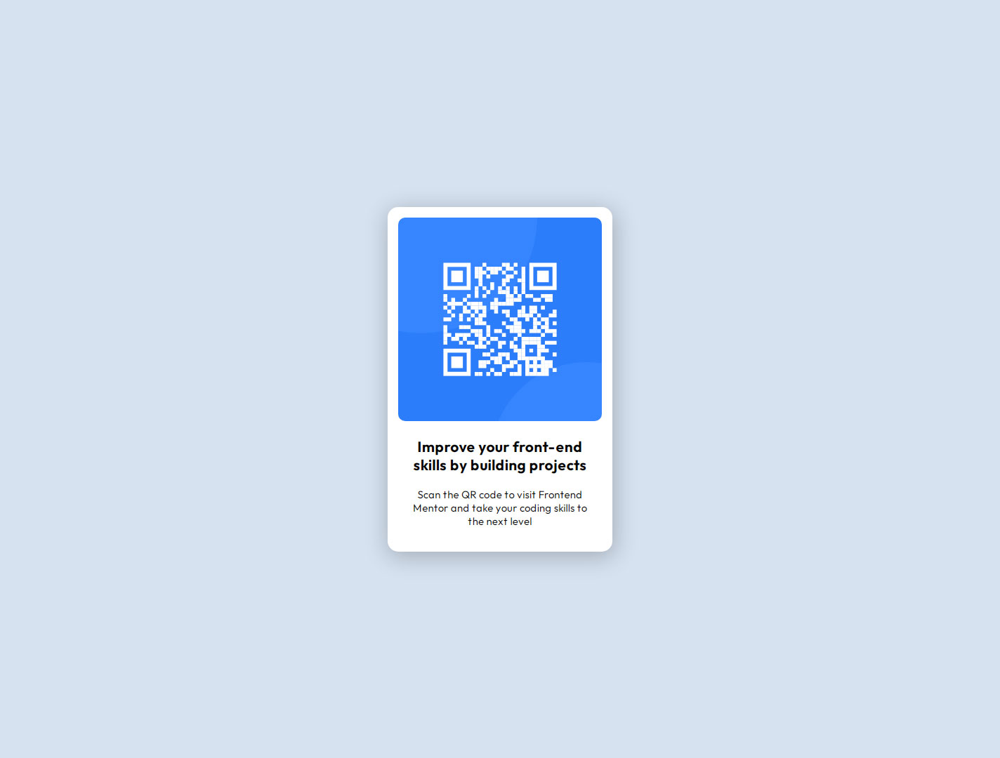

# Frontend Mentor - QR code component solution

This is a solution to the [QR code component challenge on Frontend Mentor](https://www.frontendmentor.io/challenges/qr-code-component-iux_sIO_H)

## Table of contents

- [Overview](#overview)
  - [Screenshot](#screenshot)
  - [Links](#links)
- [My process](#my-process)
  - [Built with](#built-with)
- [Author](#author)

### Screenshot

### Links

- Live Site URL: [Add live site URL here](https://qr-code-marko.netlify.app/)

### Built with

- Flexbox

## Author

- Facebook - [Marko Terzic](https://www.facebook.com/marko.terzic.585/)

